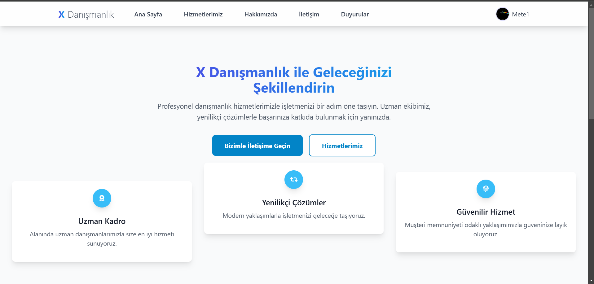
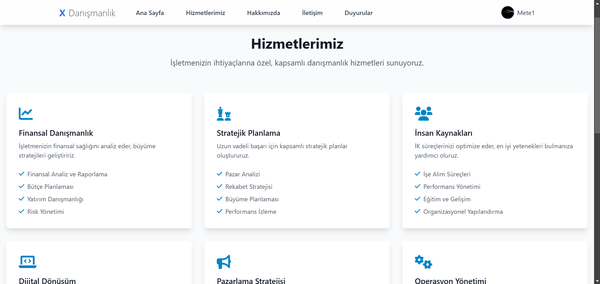
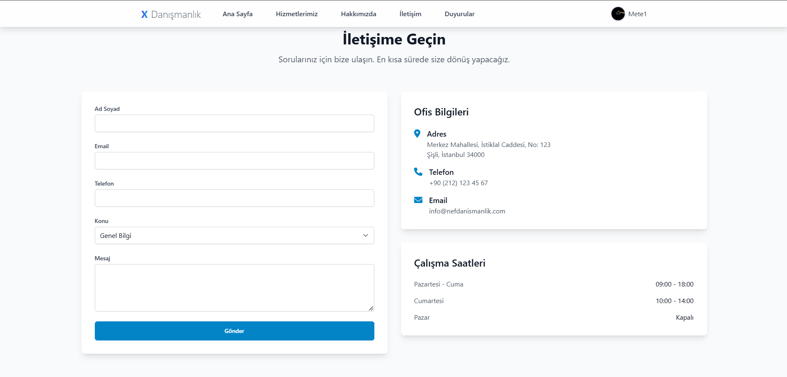
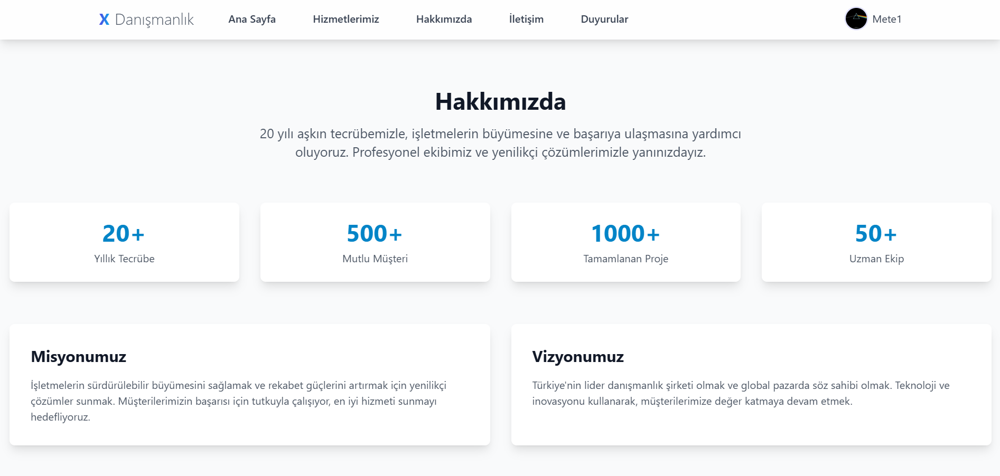
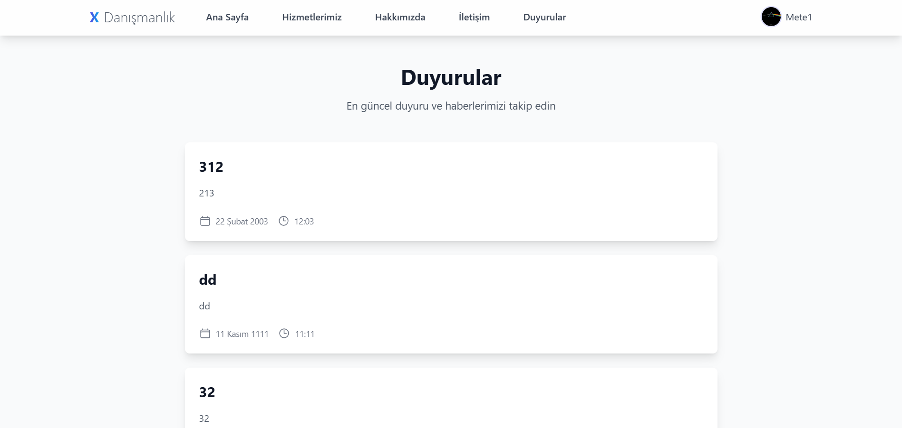
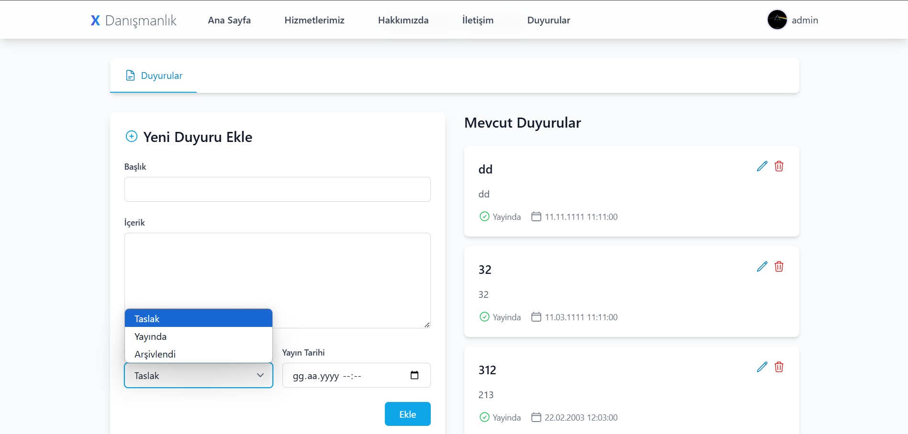
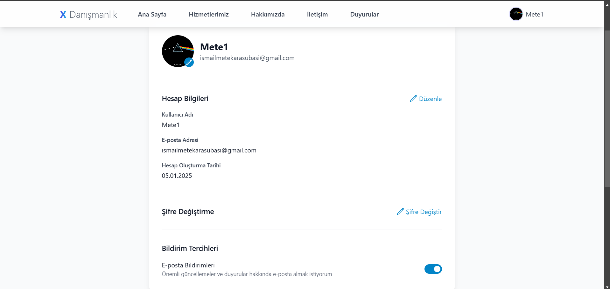

# X Danışmanlık Web Sitesi

Modern ve profesyonel bir danışmanlık şirketi web sitesi örneği. Bu proje, modern web teknolojileri kullanılarak geliştirilmiş örnek bir kurumsal web sitesidir.

## 🚀 Özellikler

- Modern ve responsive tasarım
- Kullanıcı profil yönetimi
- Duyuru sistemi
- İletişim formu
- Hizmet portföyü yönetimi
- Yönetim ekibi profilleri

## 💻 Kullanılan Teknolojiler

- HTML5
- CSS3
- JavaScript
- Bootstrap 5
- Font Awesome Icons
- Modern UI/UX prensipleri

## 📁 Proje Yapısı

```
├── assets/
│   ├── css/
│   ├── js/
│   └── images/
├── pages/
│   ├── about.html
│   ├── services.html
│   ├── contact.html
│   └── announcements.html
└── index.html
```

## 📸 Ekran Görüntüleri


### Ana Sayfa

- Modern ve kullanıcı dostu arayüz
- Şirket vizyonu ve misyonu
.png)
- Öne çıkan hizmetler

### Hizmetlerimiz Sayfası

- Detaylı hizmet açıklamaları
- Kategorize edilmiş hizmet listesi
.png)
- Alt hizmet detayları

### İletişim Sayfası

- İletişim formu
- Ofis bilgileri
- Çalışma saatleri

### Hakkımızda Sayfası

- Şirketiniz hakkında bilgiler
- Vizyon ve misyonunuz
.png)
- Deneyim seviyeniz 

### Duyurular

- Yayınlanan duyuruları görüntüleme
- Yayınlanan duyurulardan bildirim alma
- Modern ve kullanıcı dostu arayüz 

### Admin Paneli

- Duyuru yayınlama, silme, arşivleme
- Kullanıcı dostu ve modern arayüz
- Duyuru taslağı hazırlama


### Profil

- Modern ve kullanıcı dostu arayüz
- Çok çeşitli kişiselleştirme
- Kullanım kolaylığı

## ⚙️ Kurulum

1. Repoyu klonlayın
```bash
git clone https://github.com/kullaniciadi/x-danismanlik.git
```

2. Proje dizinine gidin
```bash
cd x-danismanlik
```

3. Gerekli bağımlılıkları yükleyin
```bash
npm install
```

4. Projeyi başlatın
```bash
npm start
```

## 🔧 Geliştirme

Projeyi geliştirmek için:

1. Fork'layın
2. Feature branch oluşturun (`git checkout -b feature/amazing-feature`)
3. Değişikliklerinizi commit edin (`git commit -m 'feat: Add amazing feature'`)
4. Branch'inizi push edin (`git push origin feature/amazing-feature`)
5. Pull Request oluşturun

## 📝 Lisans

Bu proje MIT lisansı altında lisanslanmıştır. Detaylar için [LICENSE](LICENSE) dosyasını inceleyebilirsiniz.

## 🤝 Katkıda Bulunma

1. Fork yapın
2. Feature branch oluşturun
3. Commit'lerinizi yapın
4. Branch'inizi push edin
5. Pull request açın

## 📧 İletişim

İsmail Mete Karasubasi
- LinkedIn: [İsmail Mete Karasubasi](https://www.linkedin.com/in/ismail-mete-karasuba%C5%9F%C4%B1-253077225/)
- Email: ismailmetekarasubasi@gmail.com
- GitHub: [@MeteKarasubasi](https://github.com/MeteKarasubasi)

Proje Linki: [https://github.com/MeteKarasubasi/Danışmanlık-Web-Sitesi](https://github.com/MeteKarasubasi/Consulting-Company-Web-Project)

